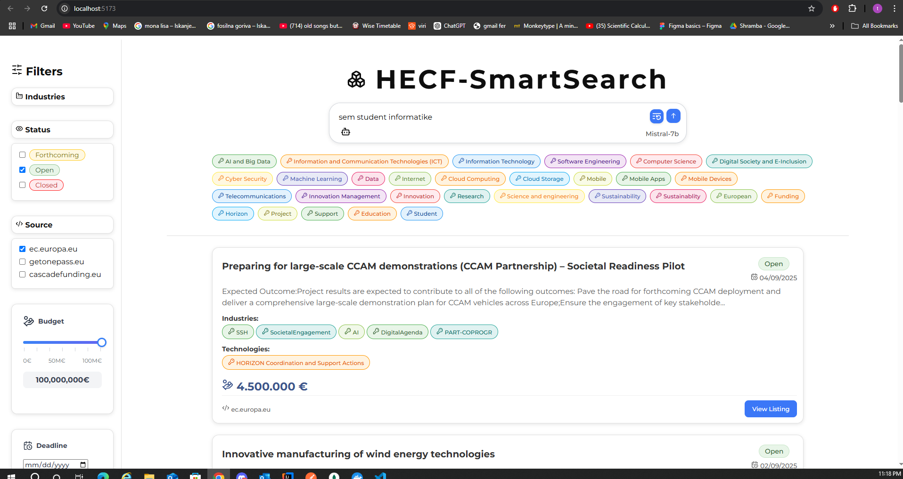
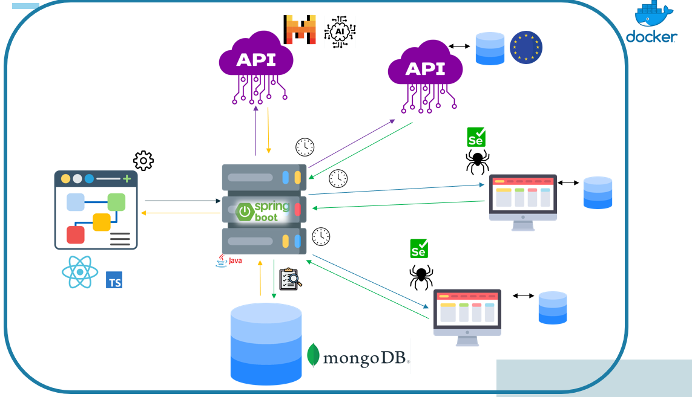
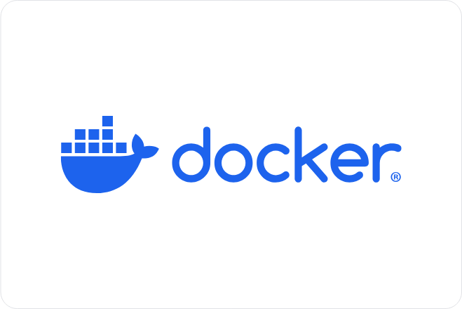
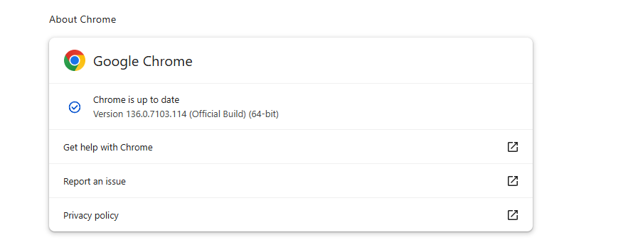
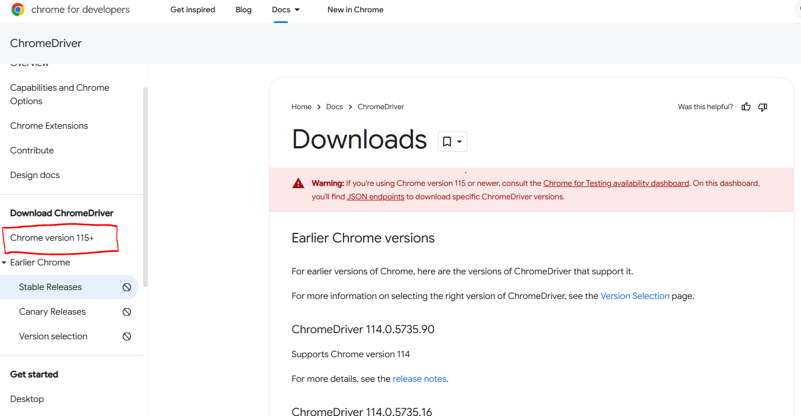
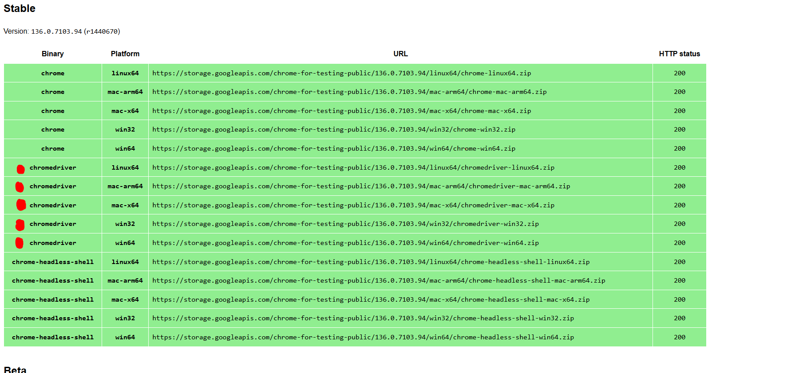

# 🚀 HECF-SmartSearch

**Pametno iskanje razpisov** – podpora pri iskanju in sledenju razpisom iz programa **Horizon Europe Cascade Funding**.  
Aplikacija omogoča filtriranje, pregledovanje in spremljanje aktualnih razpisov na enem mestu, z osredotočenostjo na uporabniku prijazno izkušnjo in hitro iskanje relevantnih informacij.
## 📚 Kazalo

- [🛠️ Navodila za namestitev potrebinh ogrodji](#-navodila-za-namestitev-potrebnih-orodij)
- [📦 Navodila za zagon](#-navodila-za-zagon)
- [🛠️ Lokalni zagon in navodila za razvijalce](#-lokalni-zagon-in-navodila-za-razvijalce)
- [🧩 Ekipa in info](#-ekipa-in-kontakt)

### 🌐 Povezava do rešitve  
🔗 **[HECF-SmartSearch](<VSTAVI-LINK-DO-REŠITVE-TUKAJ>)**

Naša rešitev podjetjem omogoča jasen, hiter in sproten **pregled nad poslovnimi priložnostmi** – brez vsakodnevnega ročnega iskanja in strahu, da bi kaj zamudili.
Z uporabo **umetne inteligence**, **samodejnega zbiranja podatkov** in **naprednega filtriranja**, podjetnikom pomagamo najti ustrezne razpise v nekaj sekundah.

 <br>

## 🔄 Samodejno zbiranje podatkov
 <br>


## 🧩  Funkcionalnosti

- 🔁 **Avtomatsko zbiranje podatkov** iz več zanesljivih spletnih virov
- 🕒 **Osveževanje vsakih 70 ur** (v nujnih primerih v manj kot 15 minutah)
- 🤖 **AI asistent**, ki:
  - analizira uporabnikov vnos
  - izbere ključne besede
  - predlaga najprimernejše razpise
- 🌍 **Podpora za angleščino in slovenščino**
- 🎯 **Napredno filtriranje** po datumu, industriji, tehnologiji in statusu razpisa (odprt/zaprt/prihajajoč)
- 👁️ **Prikaz rezultatov** v seznamu ali mrežnem pogledu
- 📨 **(v razvoju)** Tedenska e-mail obvestila z novimi razpisi iz izbranih kategorij
- 📄 **(v razvoju)** Izvoz posameznih razpisov v PDF obliki
<br>
<br>
<br>
---

# 🛠️ Navodila za namestitev potrebnih orodij
### 1. ☕ Java & JDK

Obišči: https://adoptium.net/ <br>
Prenesi Temurin JDK 21 (ali novejši) za svoj operacijski sistem. <br>
Namesti JDK in preveri v terminalu:

```bash
java -version
javac -version
```
<br>

 ### 2. 💡 IntelliJ IDEA (za Java razvoj)

Obišči: https://www.jetbrains.com/idea/download <br>
Prenesi Community ali Ultimate različico <br>
Odpri mapo 02_Backend kot Maven projekt

V meniju klikni:
File > Project Structure > SDK in nastavi ustrezen JDK
<br>

### 3. ⚛️ Node.js, npm, Vite & React 

Obišči: https://nodejs.org

Prenesi LTS različico <br>
Preveri v terminalu:

```bash
node -v
npm -v
```
Po kloniranju projekta zaženi:

```bash
cd 01_Frontend
npm install
```
<br>

 ### 4. 🐳 Docker & Docker Compose
Obišči: https://www.docker.com/products/docker-desktop/
<br>
Namesti Docker Desktop (za Windows/Mac) ali preko apt/brew za Linux/Mac

Preveri delovanje:
```bash
docker -v
docker compose version
```


### 🧪 Zdaj si pripravljen za razvoj ali testiranje celotne rešitve!
<br>
<br>

# 📦 Navodila za zagon
 <br>
 Namesto lokalnega zagona, lahko vse komponente zaženeš z Docker Compose:
 
  

```bash
cd HECF-Projekt/
docker-compose up
```
<br>
<br>


---
# 🛠️ Lokalni zagon in navodila za razvijalce

## 🌐 FRONTEND

### 🛠️ Orodja
- ⚡ **Vite** (v6.3.5)
- ⚛️ **React TypeScript** (v19.9.0)
- 📡 **Axios** (v1.9.0)

### ⚙️ Priprava
1. 📁 Odpri terminal in pojdi v mapo:  
   ```bash
   cd 01_Frontend
2. 📦 Namesti odvisnosti:
    ```bash
    npm install
     ```  

3. ▶️ Zaženi aplikacijo:
    ```bash
    npm run dev
    ```
4. 🌐 Odpri v brskalniku:
    ```bash
        http://localhost:5173
    ```
## 
## 🖥️ BACKEND

### 🛠️ Orodja
 - ☕ Java (v23)

- 🧰 Maven (v4.0.0)
- 🌱 Spring Boot (v3.4.5)
- 🧬 Lombok
- 🤖 Selenium

### ⚙️ Priprava
1. 📁 Ustvari datoteko **application.propertes** Dodaj MongoDB povezavo v datoteko:   **src/main/resources/application.properties**
    ```bash
    spring.data.mongodb.uri=mongodb+srv://<uporabnik>:<geslo>@<cluster-url>/<ime-baze>?retryWrites=true&w=majority&appName=<appName>
    ```

2. 📁Pojdi v mapo z ukazom:
    ```bash
    cd 02_Backend
    ```
    
3. ▶️ Zaženi aplikacijo:
    ```bash
    mvn spring-boot:run
    ```
##  
### 🗄️ DATABASE
### 🛠️ Orodja
 - ☁️ MongoDB Atlas (Cloud hosting)
 - 🍃 MongoDB 
##

## 🧪 Zagon celotnega projekta
V terminalu:
```bash
    cd 01_Frontend
```
```bash
    npm run dev
```
V novem terminalu:
```bash
    cd 02_Backend
```
```bash
    mvn spring-boot:run
```


##
### 🌐 Namestitev ChromeDriverja
### 🔧 Navodila:

 1. Pojdi v Chrome brskalnik in vpišite naslednje: 
 ```bash
    chrome://settings/help
 ```
 
 2. Poglej katero verzijo uporabljaš:   
   

 3. Pojdi na tole povezavo in pritisni Chrome version plus:  
 

 ```bash
    https://developer.chrome.com/docs/chromedriver/downloads
 ```
 
 4. Sedaj pa izberi pravilen chromeDriver za tvojo mašino:  
   

 5. Za konec pa vpiši ustrezen url v brskalnik naloži in razširi naložen chromeDriver
<br>
<br>

---

## 👥 Ekipa in kontakt

Smo majhna, a visoko usposobljena ekipa treh razvijalcev, ki združujemo izkušnje iz:

- 🌐 razvoja spletnih aplikacij  
- 🤖 umetne inteligence  
- 🗂️ obdelave podatkov  

👨‍💻 **Razvijalci:**
- 🧠 **Tilen Brunec**
- 🔧 **Matic Kuhar**
- 🧩 **Patrik Bevc**

📬 **Za morebitna vprašanja smo vam na voljo na e-naslovu:**

📨 **infohecfproject@gmail.com**