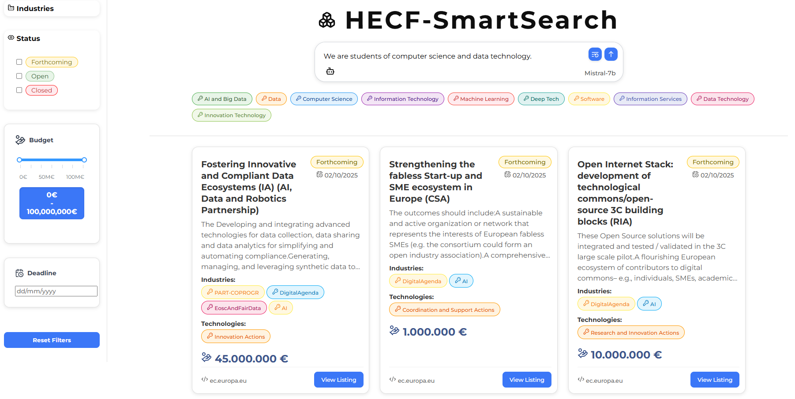
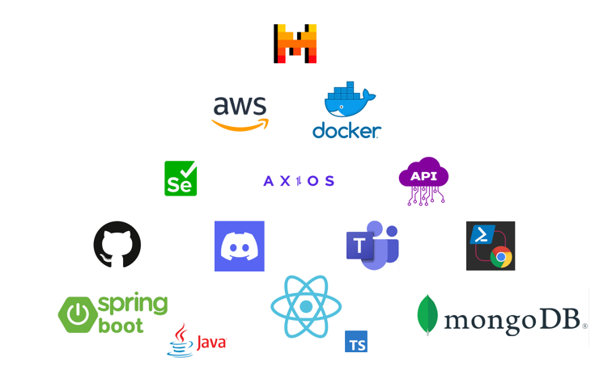

# 🚀 HECF-SmartSearch 

**Pametno iskanje razpisov** – podpora pri iskanju in sledenju razpisom iz programa **Horizon Europe Cascade Funding**.  
Aplikacija omogoča filtriranje, pregledovanje in spremljanje aktualnih razpisov na enem mestu, z osredotočenostjo na uporabniku prijazno izkušnjo in hitro iskanje relevantnih informacij. <br>
<br>
 <br>

### 🌐 Povezava do rešitve  
🔗 **[HECF-SmartSearch](<VSTAVI-LINK-DO-REŠITVE-TUKAJ>)**

## 📚 Kazalo

- [Navodila za namestitev](#-navodila-za-namestitev)
- [Navodila za zagon](#-navodila-za-zagon)
- [Lokalni zagon in navodila za razvijalce](#lokalni-zagon-in-navodila-za-razvijalce)
- [Ekipa in kontakt](#-ekipa-in-kontakt)


Naša rešitev podjetjem omogoča jasen, hiter in sproten **pregled nad poslovnimi priložnostmi** – brez vsakodnevnega ročnega iskanja in strahu, da bi kaj zamudili.
Z uporabo **umetne inteligence**, **samodejnega zbiranja podatkov** in **naprednega filtriranja**, podjetnikom pomagamo najti ustrezne razpise v nekaj sekundah.

 <br>

## 🔄 Samodejno zbiranje podatkov
 <br>


## 🧩  Funkcionalnosti

- 🔁 **Avtomatsko zbiranje podatkov** iz več zanesljivih spletnih virov
- 🕒 **Osveževanje vsakih 70 ur** (v nujnih primerih v manj kot 15 minutah)
- 🤖 **AI asistent**, ki:
  - analizira uporabnikov vnos
  - izbere ključne besede
  - predlaga najprimernejše razpise
- 🌍 **Podpora za angleščino in slovenščino**
- 🎯 **Napredno filtriranje** po datumu, industriji, tehnologiji in statusu razpisa (odprt/zaprt/prihajajoč)
- 👁️ **Prikaz rezultatov** v seznamu ali mrežnem pogledu
- 📨 **(v razvoju)** Tedenska e-mail obvestila z novimi razpisi iz izbranih kategorij
- 📄 **(v razvoju)** Izvoz posameznih razpisov v PDF obliki
<br>
<br>
---

 ## 🔧 Navodila za namestitev
### 1. ☕ Java & JDK

Obišči: https://adoptium.net/ <br>
Prenesi Temurin JDK 21 (ali novejši) za svoj operacijski sistem. <br>
Namesti JDK in preveri v terminalu:

```bash
java -version
javac -version
```
<br>

 ### 2. 💡 IntelliJ IDEA (za Java razvoj)

Obišči: https://www.jetbrains.com/idea/download <br>
Prenesi Community ali Ultimate različico <br>
Odpri mapo 02_Backend kot Maven projekt

V meniju klikni:
File > Project Structure > SDK in nastavi ustrezen JDK
<br>

### 3. ⚛️ Node.js, npm, Vite & React 

Obišči: https://nodejs.org

Prenesi LTS različico <br>
Preveri v terminalu:

```bash
node -v
npm -v
```
Po kloniranju projekta zaženi:

```bash
cd 01_Frontend
npm install
```
<br>

 ### 4. 🐳 Docker & Docker Compose
Obišči: https://www.docker.com/products/docker-desktop/
<br>
Namesti Docker Desktop (za Windows/Mac) ali preko apt/brew za Linux/Mac

Preveri delovanje:
```bash
docker -v
docker compose version
```


### 🧪 Zdaj si pripravljen za razvoj ali testiranje celotne rešitve!
<br>
<br>

# 📦 Navodila za zagon
 <br>
 Namesto lokalnega zagona, lahko vse komponente zaženeš z Docker Compose: 
 <br>
 📁 HECF-Projekt/02_Backend/docker-compose.yml

V docker-compose.yml konfiguriramo IP, PORT in PODATKE za povezavo do mongodb baze.

 ```bash
services:
  backend:
    build:
      context: .
      dockerfile: Dockerfile
    image: matickuhar/hecf-backend:latest
    container_name: hecf-backend
    volumes:
      - ./output:/app/output
    restart: always
    ports:
      - "**8080**:8080"
    environment:
      - SPRING_DATA_MONGODB_URI=mongodb://<**testUser**>:<**testUserPassword**>@mongo:27017/hecf?authSource=admin
    depends_on:
      - mongo
      - mongo-seed

  mongo:
    image: mongo:7.0
    container_name: mongodb
    restart: always
    volumes:
      - mongo_data:/data/db
    environment:
      - MONGO_INITDB_ROOT_USERNAME=<**testUser**>
      - MONGO_INITDB_ROOT_PASSWORD=<**testUserPassword**>

  mongo-seed:
    image: mongo:7.0
    depends_on:
      - mongo
    volumes:
      - ./mongo-init:/mongo-init
    entrypoint: [ "sh", "/mongo-init/init.sh" ]
    environment:
      - MONGO_INITDB_ROOT_USERNAME=<**testUser**>
      - MONGO_INITDB_ROOT_PASSWORD=<**testUserPassword**>
    restart: "no"

volumes:
  mongo_data:
```

Konfiguracijo zgradimo in poženemo z ukazom 

```bash
docker-compose -d up --build
```

Z delujočim backendom, nato zgradimo še frontend in ga poženemo
```bash
docker build -t matickuhar/hecf-frontend:latest .\01_Frontend\
docker run -d -p <**IP:PORT**>:80 -e API_URL="<IP:PORT>" matickuhar/hecf-frontend:latest
```
<br>
<br>


---
## Lokalni zagon in navodila za razvijalce
## 🌐 FRONTEND

### 🛠️ Orodja
- ⚡ **Vite** (v6.3.5)
- ⚛️ **React TypeScript** (v19.9.0)
- 📡 **Axios** (v1.9.0)

### ⚙️ Priprava
1. 📁 Odpri terminal in pojdi v mapo:  
   ```bash
   cd 01_Frontend
2. 📦 Namesti odvisnosti:
    ```bash
    npm install
     ```  

3. ▶️ Zaženi aplikacijo:
    ```bash
    npm run dev
    ```
4. 🌐 Odpri v brskalniku:
    ```bash
        http://localhost:5173
    ```
## 
## 🖥️ BACKEND

### 🛠️ Orodja
 - ☕ Java (v23)

- 🧰 Maven (v4.0.0)
- 🌱 Spring Boot (v3.4.5)
- 🧬 Lombok
- 🤖 Selenium

### ⚙️ Priprava
1. 📁 Ustvari datoteko **application.propertes** Dodaj MongoDB povezavo v datoteko:   **src/main/resources/application.properties**
    ```bash
    spring.data.mongodb.uri=mongodb+srv://<uporabnik>:<geslo>@<cluster-url>/<ime-baze>?retryWrites=true&w=majority&appName=<appName>
    ```
2. 🔑 Pojdi na https://openrouter.ai/settings/keys ; kreiraj account in svoj api 
        in v datoteko  **application.propertes** dodaj naslednje:
    ```bash
    openai.api.key= your-ai-api-key-here
    openai.api.url=  your-ai-api-url-here
    ```

3. 📁Pojdi v mapo z ukazom:
    ```bash
    cd 02_Backend
    ```
    
4. ▶️ Zaženi aplikacijo:
    ```bash
    mvn spring-boot:run
    ```
##  
### 🗄️ DATABASE
### 🛠️ Orodja
 - ☁️ MongoDB Atlas (Cloud hosting)
 - 🍃 MongoDB 
##

## 🧪 Zagon celotnega projekta
V terminalu:
```bash
    cd 01_Frontend
```
```bash
    npm run dev
```
V novem terminalu:
```bash
    cd 02_Backend
```
```bash
    mvn spring-boot:run
```


##
### 🌐 Namestitev ChromeDriverja
### 🔧 Navodila:

 1. Pojdi v Chrome brskalnik in vpišite naslednje: 
 ```bash
    chrome://settings/help
 ```
 
 2. Poglej katero verzijo uporabljaš:   
   

 3. Pojdi na tole povezavo in pritisni Chrome version plus:  
 

 ```bash
    https://developer.chrome.com/docs/chromedriver/downloads
 ```
 
 4. Sedaj pa izberi pravilen chromeDriver za tvojo mašino:  
   

 5. Za konec pa vpiši ustrezen url v brskalnik naloži in razširi naložen chromeDriver
<br>
<br>

---

## 👥 Ekipa in kontakt

Smo majhna, a visoko usposobljena ekipa treh razvijalcev, ki združujemo izkušnje iz:

- 🌐 razvoja spletnih aplikacij  
- 🤖 umetne inteligence  
- 🗂️ obdelave podatkov  

👨‍💻 **Razvijalci:**
- 🧠 **Tilen Brunec**
- 🔧 **Matic Kuhar**
- 🧩 **Patrik Bevc**

📬 **Za morebitna vprašanja smo vam na voljo na e-naslovu:**

📨 **infohecfproject@gmail.com**
